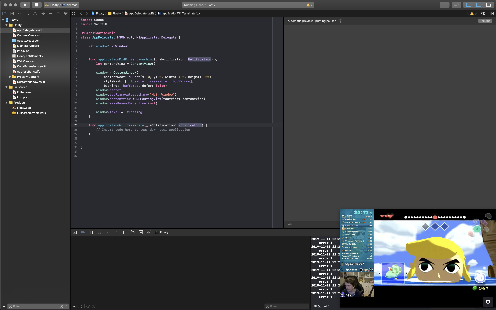

# Floaty

I like watching videos while I program. Or grind in World of Warcraft. With Floaty, you can showe a tiny window with just your video somewhere where it doesn't take up valuable screen space.

Also, I wanted to learn SwiftUI.

## Usage

Because I want the UI to be out of the way, it is somewhat unconventional. There is no title bar, for once.
- Hover over the top of the window to show the address bar
- Drag the address bar background to move the window
- Resize as normal
- Write your URL, and press GO or `enter`

